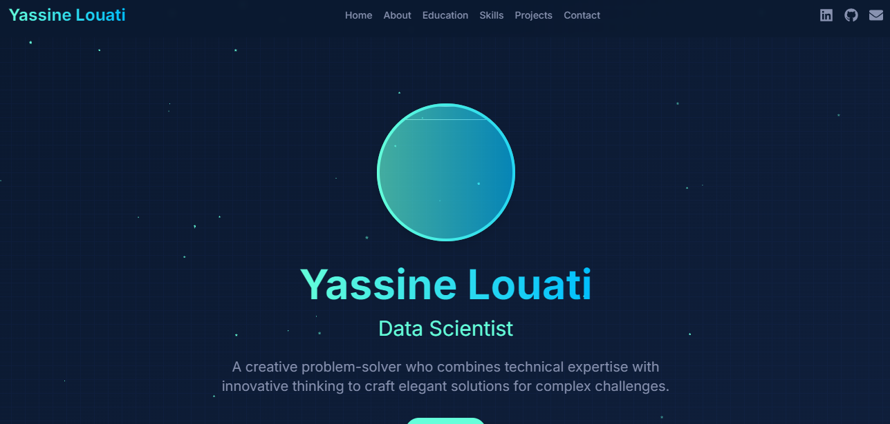
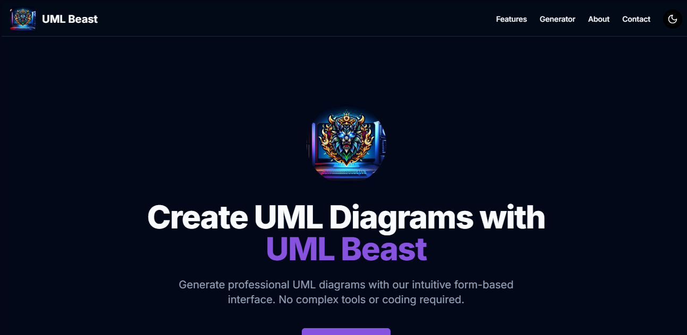
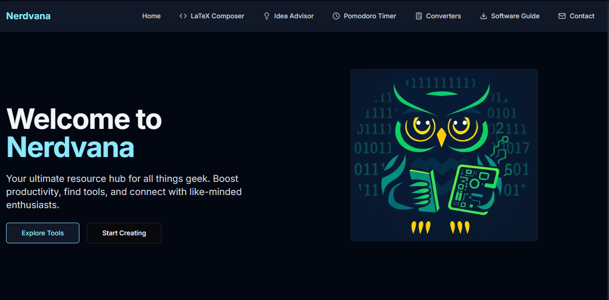
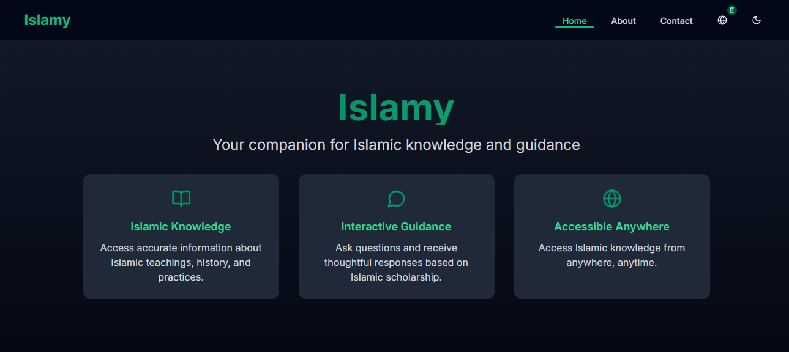
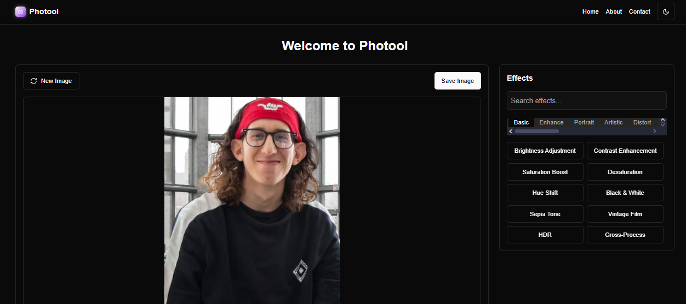

<!-- Banner Section -->

  

## Description

Welcome to my GitHub profile! I am Yassino Louati, a passionate developer skilled in various technologies. I love creating innovative projects and sharing my work with the world. Feel free to explore my repositories and connect with me through my socials below.

## 🌐 Socials:
  
  
  
  

## 💻 Tech Stack:
 
 
 
 
 
 
 
 
 
 
 
 
 
 
 
 
 
 
 
 
 
 
 
 
 
 
 
 
 
 
 
 
 
 
 
 
 
 
 

## 🌟 Featured Projects

  
  
  
  
  
  
   
  
  
  

  📫 How to reach me: <a href="mailto:louati.yessine1@gmail.com">louati.yessine1@gmail.com</a>

