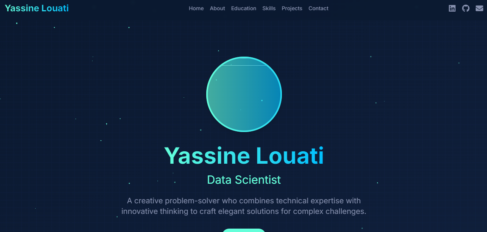
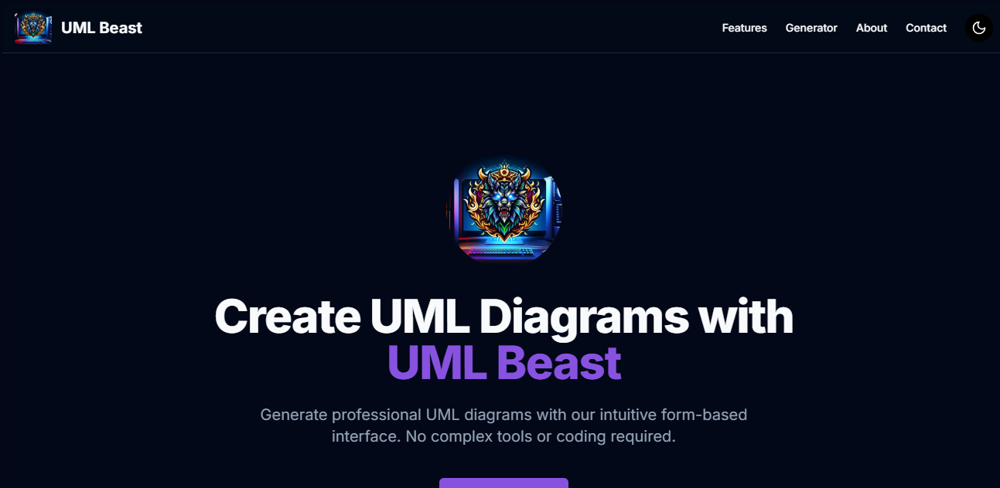
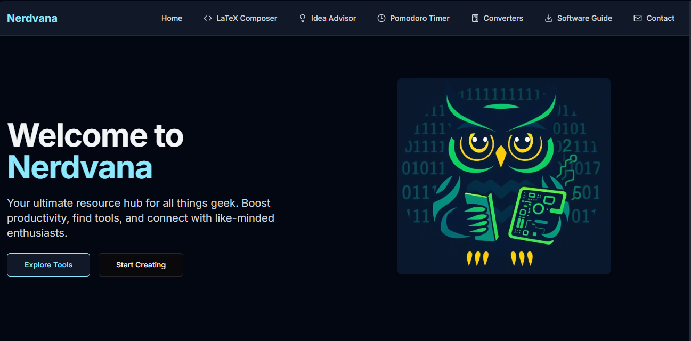
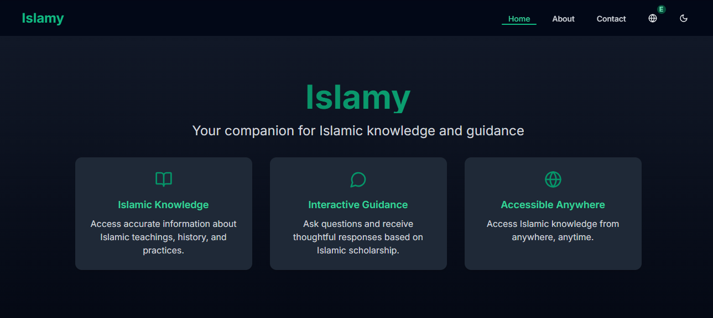
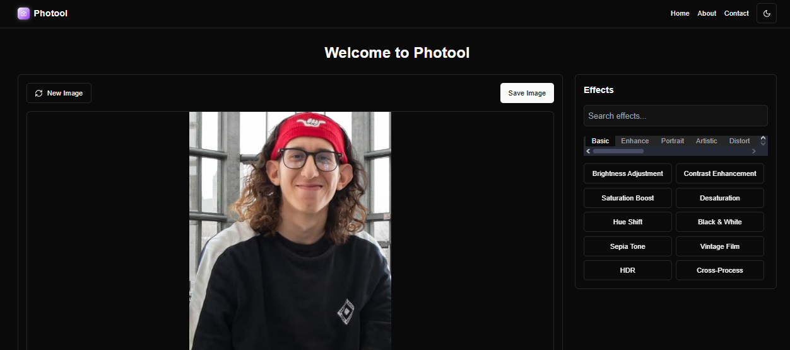

<!-- Banner Section -->

  
    
  
  <!-- Animated Typing Header -->
  
   

  <!-- Visitor Counter -->
  

 

## 🌌 About Me
Welcome to my GitHub profile! I am **Yassine Louati**, a future Data Science and AI Engineer. I love creating innovative projects and sharing my work with the world. Feel free to explore my repositories and connect with me through my socials below.

  
  
  
  

---

## 📊 GitHub Analytics

  <!-- GitHub Stats & Streak -->
  
    
  <!-- Activity Graph -->
  

---

  <!-- Snake Animation -->
  <picture>
    <source media="(prefers-color-scheme: dark)" srcset="https://raw.githubusercontent.com/Yassino14/Yassino14/output/github-contribution-grid-snake-dark.svg">
    <source media="(prefers-color-scheme: light)" srcset="https://raw.githubusercontent.com/Yassino14/Yassino14/output/github-contribution-grid-snake.svg">
    
  </picture>
    

---

## 💻 Tech Stack

  

    &nbsp;
    &nbsp;
    &nbsp;
    &nbsp;
    &nbsp;
    &nbsp;
    &nbsp;
  

  

    &nbsp;
    &nbsp;
    &nbsp;
    &nbsp;
    &nbsp;
    &nbsp;
    &nbsp;
  

  

    &nbsp;
    &nbsp;
    &nbsp;
    &nbsp;
    &nbsp;
  

  

    &nbsp;
    &nbsp;
    &nbsp;
    &nbsp;
    &nbsp;
    &nbsp;
    &nbsp;
    &nbsp;
    &nbsp;
    &nbsp;
  

  

    &nbsp;
    &nbsp;
    &nbsp;
    &nbsp;
    &nbsp;
    &nbsp;
  

  

    &nbsp;
    &nbsp;
    &nbsp;
    &nbsp;
    &nbsp;
  

---

## 📜 Certifications

*   🏆 **PCAP™ — Certified Associate Python Programmer**
*   🏆 **Agile Project Management — HP LIFE**
*   🏆 **Introduction to Prompt Engineering with GitHub Copilot**
*   🏆 **Artificial Intelligence for Business**
*   🏆 **Gemini for Google Workspace**
*   🏆 **Online Freelancing Strategies and AI**

---

## 🌟 Featured Projects

  
  
  
  
  
  
   
  
  
  

---

## 🚀 Let's Connect

  📫 <strong>How to reach me:</strong> <a href="mailto:louati.yessine1@gmail.com">louati.yessine1@gmail.com</a>

 

<!-- Footer Wave -->

  

